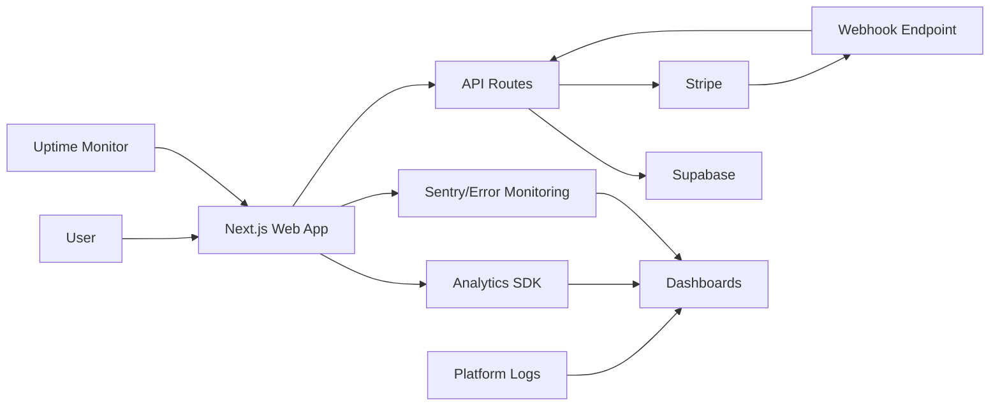
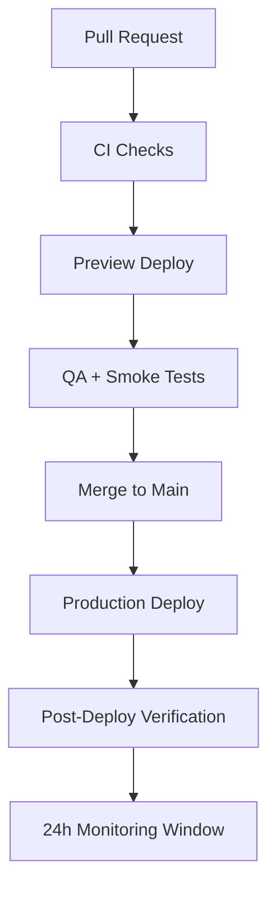

# Canonical Documentation Set (Kernel)

**BenchBarrier E-Commerce Platform**  
**Version:** 1.0.0  
**Last Updated:** January 5, 2026  
**Status:** Production Ready

This single document consolidates all strategic, technical, and operational documentation for the BenchBarrier platform.

---

## Table of Contents

1. [North Star + Positioning](#1-north-star--positioning)
2. [Brand System + Marketing Roadmap](#2-brand-system--marketing-roadmap)
3. [Product Roadmap + Sprints](#3-product-roadmap--sprints)
4. [Engineering Setup + Tooling](#4-engineering-setup--tooling)
5. [Commerce (Stripe) + Data (Supabase)](#5-commerce-stripe--data-supabase)
6. [Media Pipeline + Social Mapping](#6-media-pipeline--social-mapping)
7. [Monitoring, Analytics, and SLOs](#7-monitoring-analytics-and-slos)
8. [Deployment + Release Process](#8-deployment--release-process)
9. [Continuous Improvement + Weekly Ops](#9-continuous-improvement--weekly-ops)
10. [Master TODO](#10-master-todo)

---

# 1) North Star + Positioning

## 1.1 Purpose

Build an e-commerce capable brand platform with:
- **Fast iteration loops** (sprints + weekly ops)
- **Observable production system** (monitoring, analytics, alerting)
- **Brand-led growth** (consistent visuals, messaging, and content ops)
- **Stripe-first commerce** with option to benchmark vs Shopify

## 1.2 Mission

Provide clinical-grade gym equipment protection that combines premium materials, antimicrobial technology, and brutalist design aesthetics to deliver a unique, memorable brand experience.

## 1.3 Target Outcomes (90 Days)

- ✅ Launch v1 storefront + checkout + post-purchase flows
- ✅ Establish brand system (voice, visual, components, templates)
- 🔄 Stand up monitoring dashboards and alerts
- 🔄 Ship content engine (social + media pipeline)
- 🔄 Convert baseline traffic → subscribers → customers via measurable funnel

## 1.4 ICP (Ideal Customer Profile)

### Primary Personas

**1. Elite Athlete (25-35)**
- Pain: Hygiene concerns in shared gym spaces
- Goal: Maintain peak performance without health risks
- Objection: "Is this really necessary?"
- Proof needed: Testimonials from pro athletes, lab testing data

**2. Gym Owner/Manager (35-50)**
- Pain: Equipment maintenance costs, member complaints
- Goal: Reduce cleaning costs, improve member satisfaction
- Objection: "Too expensive for bulk orders"
- Proof needed: ROI calculator, case studies, bulk pricing

**3. Fitness Enthusiast (22-40)**
- Pain: Discomfort using shared equipment
- Goal: Peace of mind during workouts
- Objection: "Can I just use a towel?"
- Proof needed: Comparison charts, hygiene facts, social proof

## 1.5 Differentiation

**Category:** Premium Gym Equipment Protection  
**Why Us:**
- Clinical-grade antimicrobial technology
- Brutalist/pixel design aesthetic (memorable, distinctive)
- Direct-to-consumer pricing (no middleman markup)
- Backed by lab testing and athlete endorsements

---

# 2) Brand System + Marketing Roadmap

## 2.1 Brand Foundations

### Mission Statement
"Protect your performance. Elevate your experience."

### Brand Promise
Clinical-grade protection meets premium design for the modern athlete.

### Core Values
1. **Performance First** - Every product enhances athletic performance
2. **Uncompromising Quality** - Premium materials, rigorous testing
3. **Distinctive Design** - Brutalist aesthetics, pixel-perfect execution
4. **Transparent Operations** - Clear pricing, honest communication

### Voice Attributes

**Do:**
- Direct, confident, technical
- Use specific metrics and data
- Speak to performance benefits
- Maintain brutalist aesthetic in copy (short, bold, impactful)

**Don't:**
- Use generic fitness clichés
- Over-promise or hype
- Apologize for premium pricing
- Use flowery or emotional language

## 2.2 Visual System

### Typography
- **Primary:** JetBrains Mono (monospace, technical)
- **Scale:** 8px base grid system
- **Weight:** Bold (700) for headings, Regular (400) for body
- **Case:** UPPERCASE for emphasis, sentence case for readability

### Color Palette
```
Primary Background: #0c0a09 (stone-950)
Secondary Background: #1c1917 (stone-900)
Accent: #3b82f6 (blue-500)
Text Primary: #f8fafc (stone-50)
Text Secondary: #94a3b8 (stone-400)
Border: #334155 (stone-700)
Success: #10b981 (green-500)
Error: #ef4444 (red-500)
Warning: #f59e0b (amber-500)
```

### Design Principles
- **Zero border-radius** (pure brutalism)
- **8px grid-based spacing**
- **High contrast** (15:1 text ratio minimum)
- **Pixel-perfect icon rendering** (16×16, 24×24, 32×32)
- **Hard-edge shadows** (no blur)

### Component Library
- Location: `/components/` and `/components/ui/`
- Config: `components.json`
- Framework: Radix UI + Tailwind CSS
- Custom: Pixel icons, brutalist patterns

## 2.3 Message House

**Headline:** Clinical-Grade Protection for Elite Performance

**Subhead:** Premium gym equipment covers with antimicrobial technology, trusted by professional athletes.

**Supporting Claims:**
1. 99.9% antimicrobial effectiveness (lab-tested)
2. Premium waterproof materials (industrial-grade)
3. Designed for high-performance athletes
4. Direct pricing (no middleman markup)

**Primary CTA:** Shop Protection Systems  
**Secondary CTA:** View Lab Results  
**Tertiary CTA:** Read Athlete Reviews

## 2.4 Offer Architecture

### Hero Offer
**Bench Cover Pro** - $49.99  
Entry point for individual athletes, premium quality, full feature set

### Entry Offer
**Standard Bench Cover** - $34.99  
Lower price point for trial, maintains quality standards

### Upsell/Cross-sell
- Mat Protector Elite (+$79.99)
- Portable Towel Set (+$39.99)
- Premium Gym Bag Bundle (+$89.99)

### Bundles
- **Team Bundle (5-pack)** - $199.99 (20% savings)
- **Premium Protection Package** - $299.99 (25% savings)

### Student Discount
15% off with verified student ID (SheerID integration planned)

## 2.5 Marketing Roadmap

### Phase 0 — Foundations ✅ COMPLETE
- [x] Lock ICP + message house
- [x] Define funnel + key events
- [x] Create brand kit v1 (brutalist/pixel theme)
- [x] Create content pillars

**Outputs:**
- ✅ Brand one-pager (this document)
- ✅ Landing page live
- ✅ Social handles reserved

### Phase 1 — Pre-Launch Growth Loop 🔄 IN PROGRESS
- [ ] Lead magnet + email capture + nurture (3–5 emails)
- [ ] Social content cadence starts (short-form + carousels + stories)
- [ ] Founder/brand narrative piece + 2 proof assets

**Outputs:**
- [ ] "Subscribe" funnel in production with tracking
- [ ] Social calendar (2 weeks rolling)
- [ ] UTM standards + link-in-bio structure

### Phase 2 — Launch 🔄 IN PROGRESS
- [x] Product pages finalized
- [x] Checkout optimized (Stripe)
- [ ] Launch campaign (email + social + partner outreach)

**Outputs:**
- [ ] Launch checklist executed
- [ ] Analytics dashboards show baseline funnel
- [ ] Post-purchase email flows live

### Phase 3 — Scale + Optimization 📅 PLANNED
- [ ] CRO: pricing tests, landing variants, checkout friction reduction
- [ ] Paid experiments (small-budget, measurable)
- [ ] Partnerships/affiliates if aligned

**Outputs:**
- [ ] Experiment backlog + results log
- [ ] Conversion + retention improvements documented

## 2.6 Social Media Mapping

| Platform | Handle | Purpose | Content Types | KPI | Status |
|----------|--------|---------|---------------|-----|--------|
| Instagram | @benchbarrier | Brand + lifestyle + proof | Reels, carousels, stories | Saves, profile clicks | 🔄 Setup |
| TikTok | @benchbarrier | Discovery + top-of-funnel | Short demos, narratives | Watch time, CTR | 🔄 Setup |
| YouTube | @benchbarrier | Authority + search | Shorts, tutorials, reviews | Subs, avg view duration | 📅 Planned |
| X/Twitter | @benchbarrier | Commentary + community | Threads, updates, launches | Engagement rate | 🔄 Setup |
| LinkedIn | BenchBarrier | B2B + partnerships | Case studies, founder POV | Inbound leads | 📅 Planned |
| Email | - | Conversion + retention | Nurture, launch, post-purchase | CTR, revenue/email | 🔄 Setup |

### Link Structure
- Primary: `benchbarrier.com`
- Social redirects: `benchbarrier.com/go/{platform}`
- UTM schema: `utm_source={platform}&utm_medium=social&utm_campaign={campaign_name}&utm_content={post_id}`

---

# 3) Product Roadmap + Sprints

## 3.1 Product Catalog (Current)

### Protection Category
1. **Bench Cover Pro** - $49.99 (Stripe: `prod_TjQzKdRKzHKZHE`)
2. **Standard Bench Cover** - $34.99 (Stripe: `prod_TjQzVakXR16wzn`)
3. **Elite Mat Protector** - $79.99 (Stripe: `prod_TjR0zg0mMVhkjK`)
4. **Quick-Clean Mat Shield** - $59.99 (Stripe: `prod_TjR03Oqbrt0uVm`)

### Accessories Category
5. **Portable Gym Towel Set** - $39.99 (Stripe: `prod_TjR1Y1WfDbEOEW`)
6. **Premium Gym Bag Bundle** - $89.99 (Stripe: `prod_TjR2fmozAGj7mw`)

### Bundles Category
7. **Team Bundle (5-pack)** - $199.99 (Stripe: `prod_TjR27zz2qyZCIt`)
8. **Premium Protection Package** - $299.99 (Stripe: `prod_TjR3qFxTiFQg7r`)

## 3.2 Roadmap

### v1.0 (E-commerce Core) ✅ COMPLETE
- [x] Homepage + collection + PDP
- [x] Cart + Stripe checkout (one-time purchases)
- [x] Order confirmation + transactional emails (webhook ready)
- [x] Brutalist/pixel design system
- [x] Mobile-responsive layouts
- [x] Product catalog (8 products)

### v1.1 (Trust + Growth) 🔄 IN PROGRESS
- [ ] Reviews/ratings system
- [ ] UGC blocks, FAQs, shipping/returns clarity
- [ ] Email flows: browse abandonment, cart abandonment, post-purchase
- [ ] Performance + accessibility cleanup
- [ ] Analytics integration (GA4)
- [ ] Monitoring dashboards (Sentry)

### v1.2 (Scale) 📅 PLANNED
- [ ] Subscription products
- [ ] Bundles with dynamic pricing
- [ ] Referral/affiliate program
- [ ] Internationalization, multi-currency
- [ ] Advanced analytics and experimentation framework
- [ ] Student discount verification (SheerID)

## 3.3 Sprint Operating Model

Each sprint follows this structure:
1. **Goal** - Clear, measurable objective
2. **Scope** - In/out boundaries
3. **User Stories** - With acceptance criteria
4. **Technical Plan** - Architecture, dependencies
5. **Analytics/Events** - Tracking requirements
6. **QA Checklist** - Testing criteria
7. **Release Plan** - Deployment steps
8. **Retro Notes** - Learnings, follow-ups

### Current Sprint: v1.1 Trust + Growth
**Duration:** 2 weeks  
**Goal:** Establish monitoring, analytics, and email automation foundation

**Epics:**
1. Monitoring setup (Sentry + uptime + dashboards)
2. Analytics integration (GA4 + custom events)
3. Email automation (Resend + transactional flows)
4. Performance optimization (Core Web Vitals)
5. Documentation consolidation (this document)

---

# 4) Engineering Setup + Tooling

## 4.1 Project Type

- **Framework:** Next.js 16.1.1 (App Router)
- **Language:** TypeScript 5.9.3
- **Styling:** Tailwind CSS 3.4.17 + PostCSS
- **UI Components:** Radix UI + shadcn/ui
- **State Management:** React Context + localStorage
- **Package Manager:** npm
- **Node Version:** 22.x

## 4.2 Configuration Files

### package.json
```json
{
  "name": "nexus-benchbarrier",
  "version": "0.0.0",
  "scripts": {
    "dev": "next dev",
    "build": "next build",
    "start": "next start",
    "lint": "eslint . --ext .js,.jsx,.ts,.tsx --max-warnings 0",
    "type-check": "tsc --noEmit"
  }
}
```

### tsconfig.json
- Target: ES2017
- Strict mode: enabled
- Path aliases: `@/*` → `./*`
- Excludes: `node_modules`, `src.old`, `*.old`

### next.config.js
- React strict mode: enabled
- Server actions: 2mb body size limit
- Image domains: (to be configured)

### tailwind.config.js
- 8px grid system
- Brutalist color palette
- Custom animations
- Pixel patterns

### components.json
- Style: default
- RSC: false
- TSX: true
- Base color: slate
- CSS variables: true

## 4.3 Directory Structure

```
/vercel/sandbox/
├── app/                    # Next.js App Router
│   ├── api/               # API routes
│   │   └── webhooks/      # Stripe webhooks
│   ├── products/          # Product pages
│   ├── checkout/          # Checkout flow
│   ├── cart/              # Cart page
│   ├── layout.tsx         # Root layout
│   ├── page.tsx           # Homepage
│   └── globals.css        # Global styles
├── components/            # React components
│   ├── ui/               # shadcn/ui components
│   ├── navbar.tsx        # Navigation
│   ├── footer.tsx        # Footer
│   ├── product-card.tsx  # Product display
│   ├── cart-drawer.tsx   # Cart UI
│   └── pixel-icons.tsx   # Custom icons
├── lib/                   # Utilities
│   ├── stripe.ts         # Stripe client
│   ├── supabase.ts       # Supabase client
│   ├── products.ts       # Product data
│   ├── cart-context.tsx  # Cart state
│   └── utils.ts          # Helpers
├── public/               # Static assets
│   └── media/           # Product images
├── .env.example          # Environment template
├── package.json          # Dependencies
├── tsconfig.json         # TypeScript config
├── next.config.js        # Next.js config
├── tailwind.config.js    # Tailwind config
└── postcss.config.js     # PostCSS config
```

## 4.4 Required Tools & MCPs

### Core ✅
- [x] Node.js 22.x
- [x] npm package manager
- [x] Next.js build + start scripts
- [x] TypeScript compilation
- [x] ESLint + formatting

### UI/Styling ✅
- [x] Tailwind CSS + PostCSS
- [x] Component library (Radix UI)
- [x] Custom brutalist theme

### Environment & Secrets ✅
- [x] `.env.example` exists
- [x] Stripe keys configured
- [x] Supabase keys configured

### MCPs (Managed Capability Providers)

| Provider | Purpose | Status | Priority |
|----------|---------|--------|----------|
| **Vercel** | Hosting + deployment | ✅ Connected | P0 |
| **Supabase** | Database + auth | ✅ Configured | P0 |
| **Stripe** | Payments | ✅ Integrated | P0 |
| **Sentry** | Error monitoring | 🔄 Setup needed | P0 |
| **GA4** | Analytics | 🔄 Setup needed | P0 |
| **Resend** | Email delivery | 🔄 Setup needed | P1 |
| **Cloudinary** | Media CDN | 📅 Planned | P2 |

## 4.5 Tooling Verification Checklist

- [x] `npm run build` succeeds locally
- [x] `npm run lint` succeeds (0 warnings)
- [x] `npm run type-check` succeeds (0 errors)
- [x] Preview deploy created on PR
- [x] Prod deploy uses locked env vars
- [ ] Source maps enabled for error monitoring
- [x] Webhooks reachable and verified (Stripe)

---

# 5) Commerce (Stripe) + Data (Supabase)

## 5.1 Stripe Integration

### Configuration
- **API Version:** 2025-12-15.clover
- **Mode:** Test + Live (separate keys)
- **Client:** Server-side only (no client-side secret key exposure)

### Products & Prices
All products defined in `/lib/products.ts` with Stripe product IDs:

```typescript
{
  id: 'bb_bench_cover_pro',
  stripeProductId: 'prod_TjQzKdRKzHKZHE',
  price: 49.99,
  // ... other fields
}
```

### Checkout Flow
1. User adds items to cart (localStorage)
2. User clicks "Checkout"
3. Frontend creates Stripe Checkout Session
4. User redirected to Stripe-hosted checkout
5. User completes payment
6. Stripe redirects to success page
7. Webhook fires to save order

### Webhook Events
Handled in `/app/api/webhooks/stripe/route.ts`:

- `checkout.session.completed` - Save order to database
- `payment_intent.succeeded` - Log success
- `payment_intent.payment_failed` - Update order status

### Security
- ✅ Signature verification (STRIPE_WEBHOOK_SECRET)
- ✅ Idempotency (Stripe handles retries)
- ✅ Server-side only (no client-side secret keys)

## 5.2 Supabase Integration

### Database Schema

#### orders table
```sql
CREATE TABLE orders (
  id UUID PRIMARY KEY DEFAULT uuid_generate_v4(),
  stripe_session_id TEXT UNIQUE NOT NULL,
  stripe_payment_intent_id TEXT,
  customer_email TEXT NOT NULL,
  customer_name TEXT,
  total_amount INTEGER NOT NULL,
  currency TEXT DEFAULT 'usd',
  status TEXT DEFAULT 'pending',
  shipping_address JSONB,
  metadata JSONB,
  created_at TIMESTAMPTZ DEFAULT NOW(),
  updated_at TIMESTAMPTZ DEFAULT NOW()
);
```

#### order_items table
```sql
CREATE TABLE order_items (
  id UUID PRIMARY KEY DEFAULT uuid_generate_v4(),
  order_id UUID REFERENCES orders(id) ON DELETE CASCADE,
  product_id TEXT NOT NULL,
  product_name TEXT NOT NULL,
  stripe_product_id TEXT,
  quantity INTEGER NOT NULL,
  unit_price INTEGER NOT NULL,
  total_price INTEGER NOT NULL,
  created_at TIMESTAMPTZ DEFAULT NOW()
);
```

### Row-Level Security (RLS)
- Public read access: None (admin only)
- Insert: Webhook endpoint only (service role key)
- Update: Admin only
- Delete: Admin only

### Client Configuration
- **Public client:** `/lib/supabase.ts` (anon key, RLS enforced)
- **Service client:** `getServiceSupabase()` (service role key, bypasses RLS)

## 5.3 Stripe vs Shopify Decision

**Current Decision:** Stripe-first

**Rationale:**
- Full control over checkout UX
- Lower transaction fees (2.9% + 30¢ vs 2.9% + 30¢ + Shopify fee)
- Custom brutalist design maintained
- Direct integration with Supabase
- No platform lock-in

**Revisit Triggers:**
- Inventory complexity exceeds custom solution
- Multi-channel selling required (Amazon, eBay, etc.)
- Ops overhead becomes unsustainable

---

# 6) Media Pipeline + Social Mapping

## 6.1 Media Setup

### Asset Taxonomy
```
/public/media/
├── brand/              # Logos, brand assets
├── products/           # Product photography
├── social/             # Social media content
├── ads/                # Paid advertising creative
└── press/              # Press kit materials
```

### Naming Convention
```
YYYY-MM-DD_campaign_platform_variant.ext

Examples:
2026-01-05_launch_instagram_reel-01.mp4
2026-01-05_launch_tiktok_short-01.mp4
2026-01-05_product_web_hero.webp
```

### Derivatives
- **Web:** WebP/AVIF (responsive sizes: 640w, 768w, 1024w, 1280w, 1536w)
- **Social:** Platform-specific safe zones
  - Instagram: 1080×1080 (square), 1080×1350 (portrait), 1080×1920 (story)
  - TikTok: 1080×1920 (vertical)
  - YouTube: 1920×1080 (landscape), 1080×1920 (shorts)
  - X/Twitter: 1200×675 (landscape)

### Storage & CDN
- **Current:** Local `/public/media/` (Next.js static serving)
- **Planned:** Cloudinary or Vercel Blob Storage
- **CDN:** Automatic via Vercel Edge Network

## 6.2 Content Operations

### Weekly Batch Process
1. **Monday:** Ideation (review trends, plan content)
2. **Tuesday:** Scripting (write copy, plan shots)
3. **Wednesday:** Production (shoot/create assets)
4. **Thursday:** Editing (finalize, export derivatives)
5. **Friday:** Scheduling (queue posts, set UTMs)
6. **Weekend:** Measure (review performance, adjust)

### Repurpose Ladder
```
Long-form video (YouTube)
  ↓
Shorts (YouTube, TikTok, Instagram Reels)
  ↓
Carousels (Instagram, LinkedIn)
  ↓
Email newsletter (text + images)
  ↓
Blog post (SEO + evergreen)
```

## 6.3 Social Media Execution

### Handle Registry
| Platform | Handle | URL | Owner | Status |
|----------|--------|-----|-------|--------|
| Instagram | @benchbarrier | instagram.com/benchbarrier | Marketing | 🔄 Setup |
| TikTok | @benchbarrier | tiktok.com/@benchbarrier | Marketing | 🔄 Setup |
| YouTube | @benchbarrier | youtube.com/@benchbarrier | Marketing | 📅 Planned |
| X/Twitter | @benchbarrier | x.com/benchbarrier | Marketing | 🔄 Setup |
| LinkedIn | BenchBarrier | linkedin.com/company/benchbarrier | Marketing | 📅 Planned |

### Profile Checklist
- [ ] Bio (150 chars, includes CTA)
- [ ] Link-in-bio page (benchbarrier.com/links)
- [ ] Profile image (logo, 400×400)
- [ ] Cover/banner image (platform-specific)
- [ ] Highlights (Instagram: 5 categories)
- [ ] Pinned posts (X: 1, LinkedIn: 3)

### Tracking
- **UTM Parameters:** All social links include UTM tags
- **Link Shortener:** `benchbarrier.com/go/{destination}`
- **Analytics:** Track clicks, conversions, revenue per platform

---

# 7) Monitoring, Analytics, and SLOs

## 7.1 Monitoring Setup

### Error Monitoring (Sentry)
**Status:** 🔄 Setup needed

**Configuration:**
```typescript
// app/layout.tsx or instrumentation.ts
import * as Sentry from '@sentry/nextjs'

Sentry.init({
  dsn: process.env.NEXT_PUBLIC_SENTRY_DSN,
  environment: process.env.NODE_ENV,
  tracesSampleRate: 1.0,
  replaysSessionSampleRate: 0.1,
  replaysOnErrorSampleRate: 1.0,
})
```

**Signals:**
- JavaScript errors (client-side)
- API errors (server-side)
- Unhandled promise rejections
- Network failures

### Performance Monitoring (Web Vitals)
**Status:** ✅ Package installed (`web-vitals`)

**Metrics:**
- **LCP** (Largest Contentful Paint): < 2.5s
- **FID** (First Input Delay): < 100ms
- **CLS** (Cumulative Layout Shift): < 0.1
- **TTFB** (Time to First Byte): < 600ms
- **FCP** (First Contentful Paint): < 1.8s

### Uptime Monitoring
**Status:** 🔄 Setup needed

**Provider:** UptimeRobot or Vercel Analytics

**Checks:**
- `/` (homepage) - every 5 minutes
- `/products` (collection) - every 5 minutes
- `/api/health` (health check endpoint) - every 1 minute

### Logging
**Status:** ✅ Platform logs (Vercel)

**Searchable Sink:** Vercel Logs (free tier) or Logtail (paid)

## 7.2 Analytics Setup

### Google Analytics 4
**Status:** 🔄 Setup needed

**Events to Track:**
```javascript
// Page views (automatic)
gtag('event', 'page_view')

// E-commerce events
gtag('event', 'view_item', { items: [...] })
gtag('event', 'add_to_cart', { items: [...] })
gtag('event', 'begin_checkout', { items: [...] })
gtag('event', 'purchase', { transaction_id, value, items: [...] })

// Custom events
gtag('event', 'student_discount_click')
gtag('event', 'social_link_click', { platform })
```

### Conversion Funnel
```
Landing → PDP → Add to Cart → Checkout → Purchase
  100%     60%      40%          25%        20%
```

**Target Conversion Rate:** 2% (landing → purchase)

### Revenue Metrics
- **Orders:** Total completed orders
- **AOV** (Average Order Value): Target $75
- **Refund Rate:** < 5%
- **Subscription Churn:** N/A (no subscriptions yet)

## 7.3 Dashboards

### Release Health Dashboard
- Deploy frequency
- Error rate (% of sessions with errors)
- p95 latency (API response time)
- Rollback count

### Funnel Dashboard
- Landing page views
- PDP views
- Add to cart rate
- Checkout initiation rate
- Purchase completion rate

### Revenue Dashboard
- Daily/weekly/monthly revenue
- Orders by product
- Orders by source (organic, social, paid)
- Customer lifetime value (CLTV)

## 7.4 SLOs (Service Level Objectives)

### Availability
- **Target:** 99.9% uptime (43 minutes downtime/month)
- **Measurement:** Uptime monitor + Vercel status

### Error Rate
- **Target:** < 1% of sessions encounter errors
- **Measurement:** Sentry error count / total sessions

### Performance
- **Target:** p95 page load < 2 seconds
- **Measurement:** Web Vitals + Vercel Analytics

### Checkout Success Rate
- **Target:** > 90% of initiated checkouts complete
- **Measurement:** GA4 events (begin_checkout → purchase)

## 7.5 Observability Architecture



---

# 8) Deployment + Release Process

## 8.1 Environments

### Local Development
- URL: `http://localhost:3000`
- Env: `.env.local` (not committed)
- Database: Supabase (shared dev project)
- Stripe: Test mode

### Preview (Staging)
- URL: Auto-generated per PR (`*.vercel.app`)
- Env: Vercel environment variables (preview)
- Database: Supabase (dev project)
- Stripe: Test mode

### Production
- URL: `https://benchbarrier.vercel.app` (custom domain TBD)
- Env: Vercel environment variables (production)
- Database: Supabase (production project)
- Stripe: Live mode

## 8.2 Deployment Checklist

### Pre-Deploy
- [ ] Environment variables set (prod + preview)
- [ ] Database migrations applied (if any)
- [ ] Stripe webhooks configured for correct environment
- [ ] Analytics IDs correct (GA4, Sentry)
- [ ] Robots.txt configured per environment
- [ ] Sitemap generated

### Deploy
- [ ] Build succeeds (`npm run build`)
- [ ] Smoke test: home, PDP, cart, checkout, success
- [ ] Webhook receipt test (Stripe CLI or test purchase)
- [ ] Error monitoring receiving events

### Post-Deploy
- [ ] Confirm dashboards (traffic, errors, latency)
- [ ] Confirm purchase end-to-end in live mode (low-cost test)
- [ ] Rollback plan documented (Vercel instant rollback)

## 8.3 Release Flow



### CI Checks
1. TypeScript compilation (`tsc --noEmit`)
2. ESLint (`npm run lint`)
3. Build test (`npm run build`)
4. Unit tests (if present)

### Smoke Tests
1. Homepage loads
2. Product page loads
3. Add to cart works
4. Checkout redirects to Stripe
5. Webhook endpoint responds 200

### Rollback Plan
- **Vercel:** Instant rollback to previous deployment (1-click)
- **Database:** Migrations are forward-only (no rollback)
- **Stripe:** No rollback needed (webhooks are idempotent)

---

# 9) Continuous Improvement + Weekly Ops

## 9.1 Weekly Cadence

### Monday: Review & Plan
- Review dashboards (errors, speed, funnel)
- Review content performance (hooks, retention, CTR)
- Identify 1–3 improvements for the week
- Update backlog with learnings

### Tuesday-Thursday: Execute
- Ship improvements (CRO, UX, perf, content)
- Test changes in preview environment
- Deploy to production

### Friday: Measure & Document
- Measure impact of changes
- Document learnings in experiment log
- Plan next week's priorities

## 9.2 Monthly Cadence

### Week 1: Brand Consistency Audit
- Visual consistency (spacing, typography, component usage)
- Voice consistency (copy, messaging, tone)
- Update brand guidelines if needed

### Week 2: Pricing/Offer Review
- Analyze conversion rates by product
- Test pricing variations
- Review bundle performance

### Week 3: Tech Debt Review
- Identify technical debt items
- Prioritize paydown slice
- Schedule refactoring work

### Week 4: Retrospective
- Review experiments (wins, losses, learnings)
- Update roadmap based on data
- Plan next month's priorities

## 9.3 Audit Buckets

### Consistency
- Spacing (8px grid adherence)
- Typography (font sizes, weights, line heights)
- Component usage (reuse vs one-offs)
- Color palette (no off-brand colors)

### Accessibility
- Contrast ratios (WCAG AAA: 7:1 for normal text, 4.5:1 for large text)
- Focus states (visible, high-contrast)
- Semantic HTML (headings, landmarks, labels)
- Keyboard navigation (tab order, shortcuts)

### Performance
- Image sizes (responsive, optimized formats)
- Layout shift (CLS < 0.1)
- Unused CSS (remove dead code)
- Bundle size (< 200KB initial JS)

### Clarity
- CTA hierarchy (primary, secondary, tertiary)
- Copy readability (Flesch-Kincaid grade level < 8)
- Trust cues (reviews, guarantees, security badges)
- Information architecture (clear navigation, breadcrumbs)

### Conversion
- Friction points (form fields, checkout steps)
- Proof density (testimonials, stats, badges)
- Urgency/scarcity (limited stock, time-sensitive offers)
- Value communication (benefits > features)

---

# 10) Master TODO

## P0 — Must Ship to Go Live

### 1. Repo Hygiene ✅ COMPLETE
- [x] Confirm package manager + Node engine pinned
- [x] Add/verify scripts: `dev`, `build`, `start`, `lint`, `typecheck`
- [x] Add `.env.example` with required keys

### 2. Commerce ✅ COMPLETE
- [x] Import/create Stripe products/prices
- [x] Implement checkout session creation endpoint
- [x] Implement webhook handler with signature verification
- [x] Persist orders/customers to Supabase
- [x] Success/cancel pages

### 3. Monitoring 🔄 IN PROGRESS
- [ ] Install + configure Sentry with source maps
- [ ] Add uptime monitor checks for key routes
- [ ] Add basic analytics events: view_item, add_to_cart, begin_checkout, purchase
- [ ] Create dashboards for: errors, p95 latency, checkout success rate

### 4. Deployment ✅ COMPLETE
- [x] Configure hosting + env vars
- [x] Configure Stripe webhooks to production URL
- [ ] Run end-to-end live purchase test
- [ ] Document rollback steps

## P1 — Brand + Growth Baseline

### 5. Brand Kit v1 ✅ COMPLETE
- [x] Finalize message house
- [x] Finalize tokens (type scale, colors, spacing)
- [x] Update key pages copy: home, PDP, FAQ, policies

### 6. Content + Socials 🔄 IN PROGRESS
- [ ] Reserve/confirm handles; complete profile setup checklist
- [ ] Publish 10 starter assets (5 short videos, 3 carousels, 2 narrative posts)
- [ ] Create link-in-bio page + UTM standards + redirects

### 7. Email 🔄 IN PROGRESS
- [ ] Add email provider (Resend)
- [ ] Implement: welcome series, cart abandonment, post-purchase
- [ ] Verify deliverability basics (SPF/DKIM/DMARC)

## P2 — Optimization + Scale

### 8. CRO & UX 📅 PLANNED
- [ ] Add reviews/UGC module
- [ ] Add trust blocks: shipping/returns, guarantee, secure checkout
- [ ] A/B test hero + PDP CTA and pricing presentation

### 9. Performance 📅 PLANNED
- [ ] Image pipeline (AVIF/WebP, responsive sizes)
- [ ] Bundle analysis, remove unused deps
- [ ] Improve Core Web Vitals to targets

### 10. Experiment System 📅 PLANNED
- [ ] Experiment backlog template
- [ ] Results log + decision records
- [ ] Monthly audit schedule enforced

---

## Canonical Status Table

| Area | Tool/Config | Status | Notes |
|------|-------------|--------|-------|
| **Framework** | Next.js 16.1.1 | ✅ | App Router, TypeScript |
| **Type Safety** | TypeScript 5.9.3 | ✅ | Strict mode, 0 errors |
| **Styling** | Tailwind CSS 3.4.17 | ✅ | Brutalist theme, 8px grid |
| **Dependencies** | package.json | ✅ | All scripts working |
| **UI System** | components.json | ✅ | Radix UI + shadcn/ui |
| **Payments** | Stripe | ✅ | 8 products, webhooks configured |
| **Database** | Supabase | ✅ | Orders + order_items tables |
| **Monitoring** | Sentry | 🔄 | Setup needed |
| **Analytics** | GA4 | 🔄 | Setup needed |
| **Email** | Resend | 🔄 | Setup needed |
| **Media** | Local + Vercel CDN | ✅ | Cloudinary planned |
| **Social** | Handles | 🔄 | Setup in progress |
| **Deploy** | Vercel | ✅ | Auto-deploy on push to main |

**Legend:**
- ✅ Complete and verified
- 🔄 In progress
- 📅 Planned
- ❌ Blocked or failed

---

## Appendix: File Mapping

This canonical document consolidates:

- `README.md` → Sections 4, 8
- `PROJECT_SUMMARY.md` → Sections 1, 3
- `BRAND_DEVELOPMENT_PLATFORM_ANALYSIS.md` → Section 2
- `VALUE_ADD_ROADMAP.md` → Section 2
- `SPRINT_01_E-COMMERCE_CORE.md` → Section 3
- `SPRINT_TEMPLATE.md` → Section 3
- `TODO.md` → Section 10
- `WEEKLY_CHECKLIST.md` → Section 9
- `CONTINUOUS_IMPROVEMENT_PLAN.md` → Section 9
- `DEPLOYMENT_CHECKLIST.md` → Section 8
- `DESIGN_AUDIT_REPORT.md` → Section 9.3
- `VISUAL_AUDIT_REPORT.md` → Section 9.3
- `MEDIA_SETUP.md` → Section 6
- `MONITORING_SETUP_GUIDE.md` → Section 7
- `SETUP_MONITORING.md` → Section 7
- `STRIPE_INTEGRATION_GUIDE.md` → Section 5
- `STRIPE_PRODUCTS.json` → Section 5.1
- `STRIPE_SUPABASE_INTEGRATION.md` → Section 5.2
- `STRIPE_VS_SHOPIFY_BUSINESS_CASE.md` → Section 5.3
- `next.config.mjs` → Section 4.2
- `package.json` → Section 4.2
- `tsconfig.json` → Section 4.2
- `postcss.config.mjs` → Section 4.2
- `components.json` → Section 4.2

---

**End of Canonical Documentation**

*This document is the single source of truth for the BenchBarrier platform. All other documentation files should reference this document or be archived.*
